# Virtual Box

## 事前準備

下記サイトから`Visual C++ 再頒布可能パッケージ`をダウンロードしてインストールする

https://learn.microsoft.com/ja-jp/cpp/windows/latest-supported-vc-redist?view=msvc-170

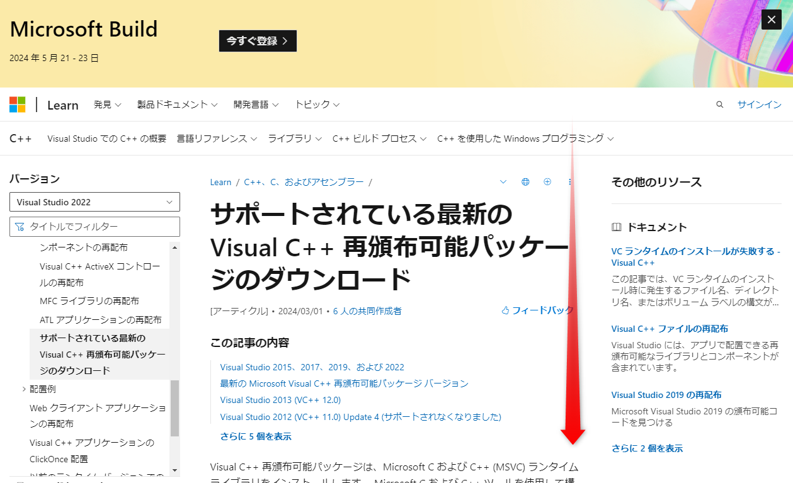

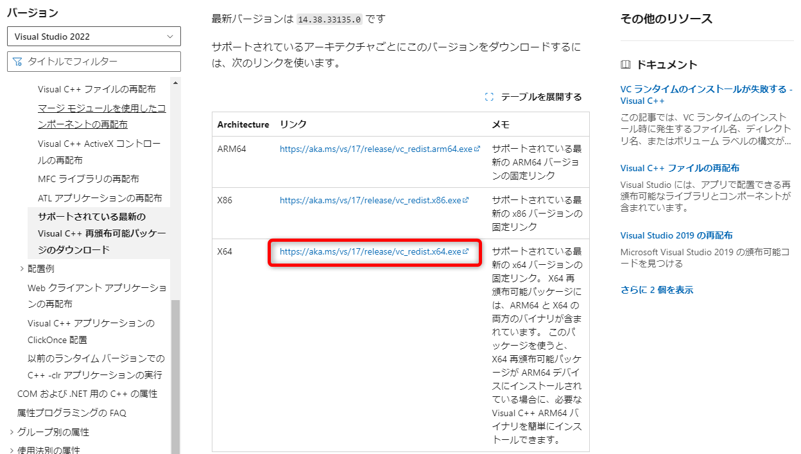

## インストールの手順

### ダウンロード

下記サイトからVirtual Boxをダウンロードする  
https://www.virtualbox.org/

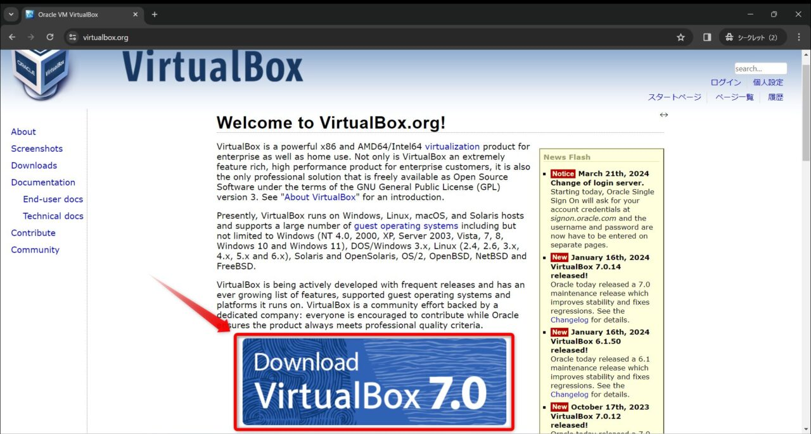

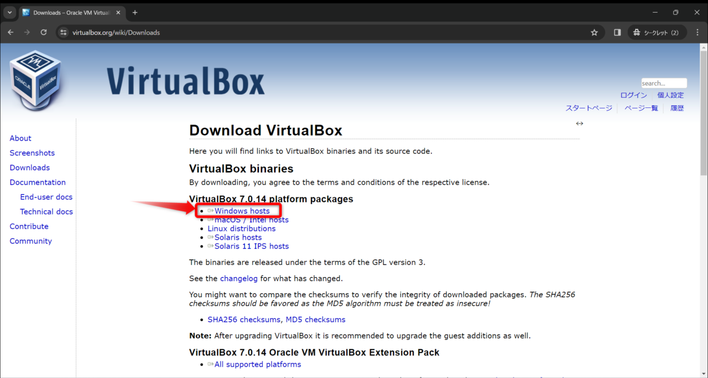

### インストール

ダウンロードしたファイルを実行

`Next`をクリック  
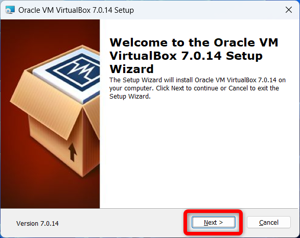

`Next`をクリック  
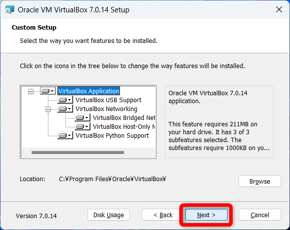

`Yes`をクリック  
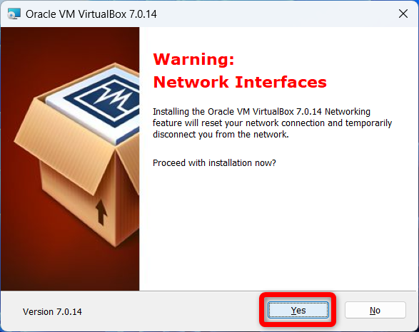

`Yes`をクリック  
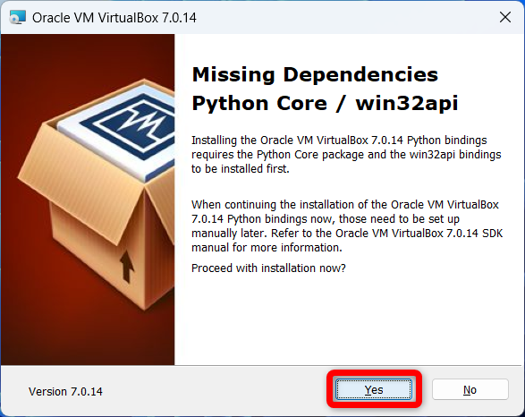

`Install`をクリック  
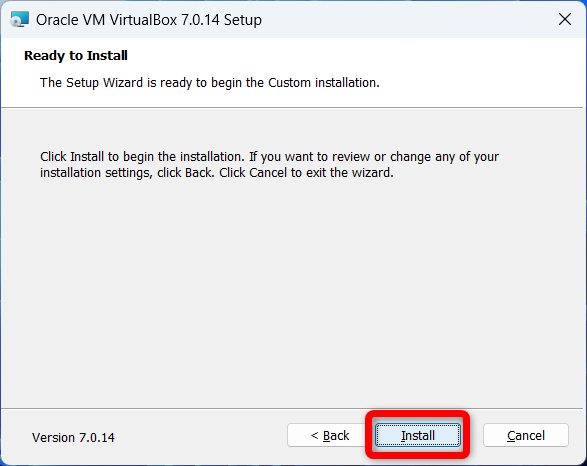

インストールが始まるので少し待つ  
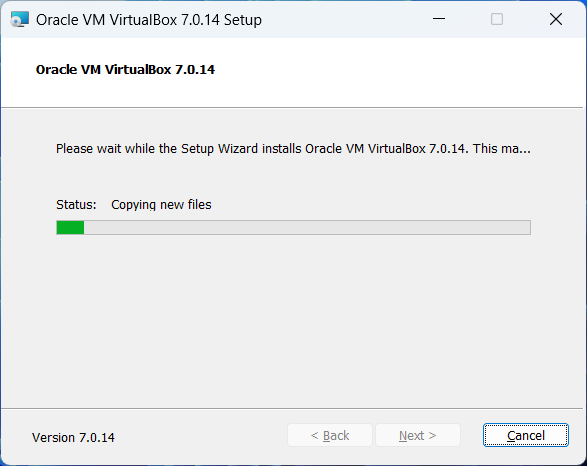

`Finish`をクリック  
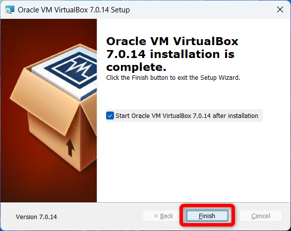

Virtual Boxが起動すればインストール完了
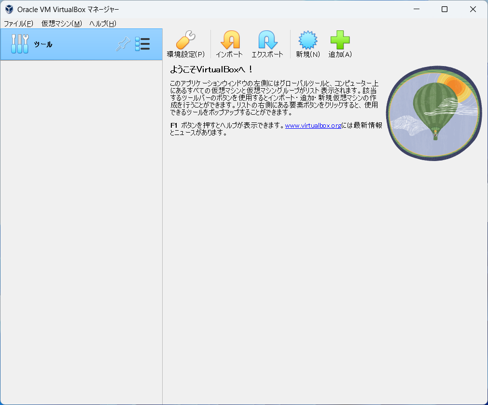
